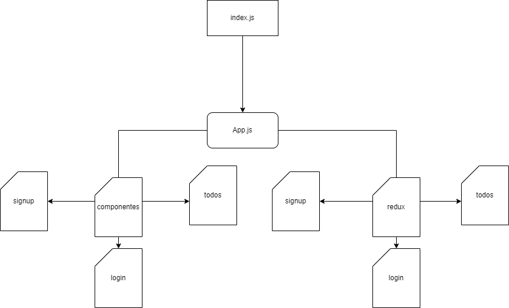

## Description

***dataBASE*** is the resource for all BASE jumpers around the world to check the weather conditions of different jumps across the world cross referencing latitude and longitude of exit points and the Windy API


## User Stories

- **Signup:** As an anon I can sign up in the platform so that I can start playing into competition
- **Login:** As a user I can login to the platform so that I can log my exit points
- **Logout:** As a user I can logout from the platform so no one else can use it


# Client / Frontend

## React Router Routes (React App)

| Path             | Component            | Permissions                | Behavior                                                     |
| ---------------- | -------------------- | -------------------------- | ------------------------------------------------------------ |
| `/`              | SplashPage           | public `<Route>`           | Home page                                                    |
| `/signup`        | SignupPage           | anon only `<AnonRoute>`    | Signup form, link to login, navigate to homepage after signup |
| `/login`         | LoginPage            | anon only `<AnonRoute>`    | Login form, link to signup, navigate to homepage after login |
| `/exitpoint`     | TournamentListPage   | user only `<PrivateRoute>` | Shows all exit points in a list                              |
|                  |                      |                            |                                                              |
|                  |                      |                            |                                                              |
|                  |                      |                            |                                                              |
|                  |                      |                            |                                                              |
|                  |                      |                            |                                                              |
|                  |                      |                            |                                                              |
|                  |                      |                            |                                                              |

## Components

- LoginPage
- resgisterPage
- todosPage


# Server / Backend

## Models

User model

```
{
  user: {type: String, required: true, unique: true},
  email: {type: String, required: true, unique: true},
  password: {type: String, required: true},
}
```


```
 {
   name: {type: String, required: true},
   img: {type: String},
   password: {type: Number, required: true}
   role: {type: String, required: true}
   
 }
```


## Backend routes

| HTTP Method | URL            | Request Body                                                 | Success status | Error Status | Description                                                  |
| ----------- | -------------- | ------------------------------------------------------------ | -------------- | ------------ | ------------------------------------------------------------ |
| GET         | `/auth/me`     |                                                              | 200            | 404          | Check if user is logged in and return profile page           |
| POST        | `/auth/signup` | {name, email, password}                                      | 201            | 404          | Checks if fields not empty (422) and user not exists (409), then create user with encrypted password, and store user in session |
| POST        | `/auth/login`  | {username, password}                                         | 200            | 401          | Checks if fields not empty (422), if user exists (404), and if password matches (404), then stores user in session |
| POST        | `/auth/logout` | (empty)                                                      | 204            | 400          | Logs out the user                                            |
| POST        | /api/exit      | {name, img, aproachLat, aproachLong, aproachDescription, exitLat, exitLong, exitDescription, landingZoneLat, landingZoneLong, landingZoneDescription, altitude} |                |              | Used to create one exit point document, using current logged in user id as a creator. |
| PUT         | /api/exit/:id  | {name, img, aproachLat, aproachLong, aproachDescription, exitLat, exitLong, exitDescription, landingZoneLat, landingZoneLong, landingZoneDescription, altitude} |                |              | Used to update one exit point document by id                 |
| GET         | /api/exit/:id  |                                                              |                |              | Used to get one exit point document by id                    |
| DELETE      | /api/exit/:id  |                                                              |                |              | Used to delete one exit point document by id                 |
| GET         | /api/user      |                                                              |                |              | Used to get current user's profile. Id of the user is coming form the req.session.currentUser |
| PUT         | /api/user      | {username, email, password}                                  |                |              | Used to update current user's profile. Id of the user is coming form the req.session.currentUser |

## Links


### Git

The url to your repository and to your deployed project

[Client repository Link](https://github.com)

[Server repository Link](https://github.com)

==================

